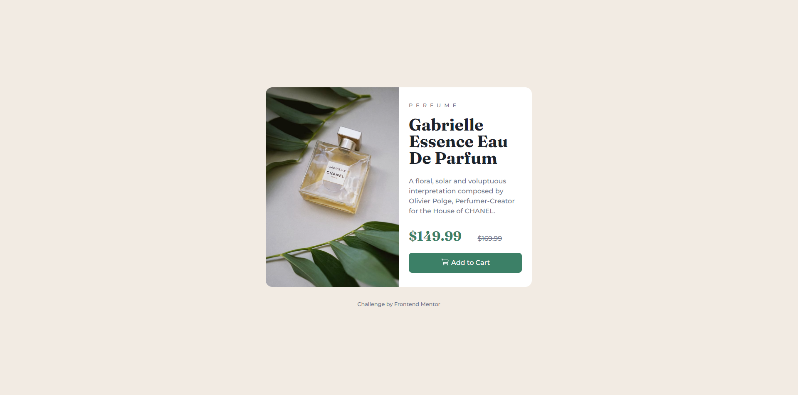

# Frontend Mentor - Product preview card component solution

This is a solution to the [Product preview card component challenge on Frontend Mentor](https://www.frontendmentor.io/challenges/product-preview-card-component-GO7UmttRfa). Frontend Mentor challenges help you improve your coding skills by building realistic projects.

## Table of contents

- [Overview](#overview)
  - [The challenge](#the-challenge)
  - [Screenshot](#screenshot)
  - [Links](#links)
- [My process](#my-process)
  - [Built with](#built-with)
  - [What I learned](#what-i-learned)
  - [Continued development](#continued-development)
- [Author](#author)

## Overview

This is my entry to a challenge posted by Frontend Mentor. I'm using the challenges there to continue practicing my html and CSS skills while learning other languages aswell.

### The challenge

Users should be able to:

- View the optimal layout depending on their device's screen size
- See hover and focus states for interactive elements

### Screenshot

### Links

I have not currently uploaded this challenge to any site.

## My process

The process I used on this project was pretty straight forward.
I knew I wanted the card to be split in the middle, with the image on the left side, and the info about the product on the right. So in my solution I used grid, with a grid-template-columns of 1fr 1fr on the card itself.

I mainly used flex to position all the info about the product on the right side.

### Built with

- Semantic HTML5 markup
- Flexbox
- CSS Grid
- Desktop first workflow

### What I learned

I used this project to continue to practice on writing html and styling it with CSS. I'm currently learning Javascript aswell. So these challenges are a fun way of implementing what I've learned about html and CSS.

### Continued development

I'm still going to work on these projects from Frontend Mentor in the future, while learning about javascript. Hopefully I would be able to make a website using html, css and javascript together soon. I'm also new to github in general, so this is also a way for me to familiarize myself with that aswell.

## Author

- Frontend Mentor - [@AndersenIA](https://www.frontendmentor.io/profile/AndersenIA)
